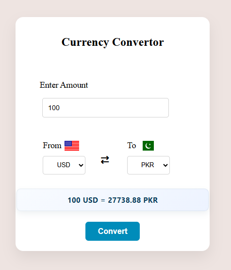

# Currency Converter 💱

A simple and responsive **Currency Converter** web application built with HTML, CSS, and JavaScript. It allows users to select currencies and convert an amount using exchange rate data from an API.

## 🚀 Features

* Convert between different currencies
* Real-time exchange rate data
* Country flags for currencies
* Simple and clean user interface
* Responsive design
* Easy-to-use currency selection
* Built with vanilla JavaScript

## 🛠️ Technologies Used

* HTML5
* CSS3
* JavaScript
* Currency Exchange API
* Flags API

## 📸 Screenshot



## 📂 Project Structure

```text
currency-converter/
│
├── index.html
├── style.css
├── script.js
└── currency.png
```

## 💡 What I Learned

While building this project, I practiced:

* Working with APIs
* Using `fetch()` to get data
* Using `async/await`
* Handling JSON data
* Working with DOM manipulation
* Using JavaScript objects and arrays
* Dynamically updating HTML elements
* Working with country flags
* Creating a responsive interface

## 👨‍💻 Author

**Hamza Saeed**

GitHub: [Code-with-Humza](https://github.com/Code-with-Humza)
